I have been playing a solitaire-like game called FreeCell, as part of the iOS app "Offline Games". The game is similar to solitaire - the goal is to move all cards to foundation piles, starting with aces and building up by suit.

{: width="400px" .mx-auto.d-block :}

As you can see, I have solved over 500 levels. Yes, I am really into this game. It's a good way to kill idle time.

I sometimes run into particularly stubborn levels that require a lot of backtracking. I was curious if I could write a solver for it. Additionally, I wanted to know if there are unsolvable cases. Again, a solver could be useful to verify if a level is unsolvable. It turned into a fun weekend project.

## Game Rules
- The game starts with cards dealt into tableau piles. There are 8 tableau piles, 4 temporary slots, and 4 foundation piles.
- A card can be moved to another pile if the destination pile has a card of the opposite color, with a value one higher.
- Cards can be moved as a group if the group forms a descending sequence of alternating colors.
  - We solve in the hardest difficulty level, where cards can be moved in groups only if the move could've been done one card at a time as well.
- Empty tableau spots can be filled with any card.
- There are temporary slots where single cards can be stored.
- Cards can be moved to foundation piles when the next card in sequence is available. They must be built up from Ace by suit.
  - A card can be moved from foundation pile to other parts of the game.
- The game allows multiple undo moves, all the way to the start. Backtracking is pretty much always necessary to solve.

As an example, using the above starting position, the following sequence of moves can be made:

<details markdown="1">
<summary>Example</summary>
<div style="display: flex; flex-wrap: wrap; align-items: center; justify-content: center; gap: 5px;">
  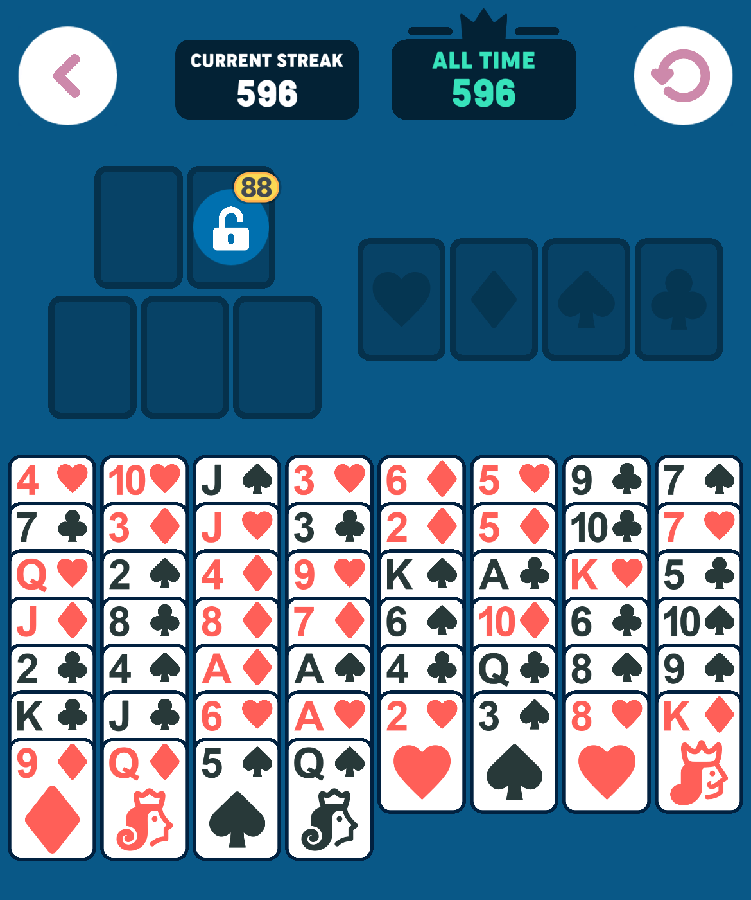
  <div style="font-size: 2em;">→</div>
  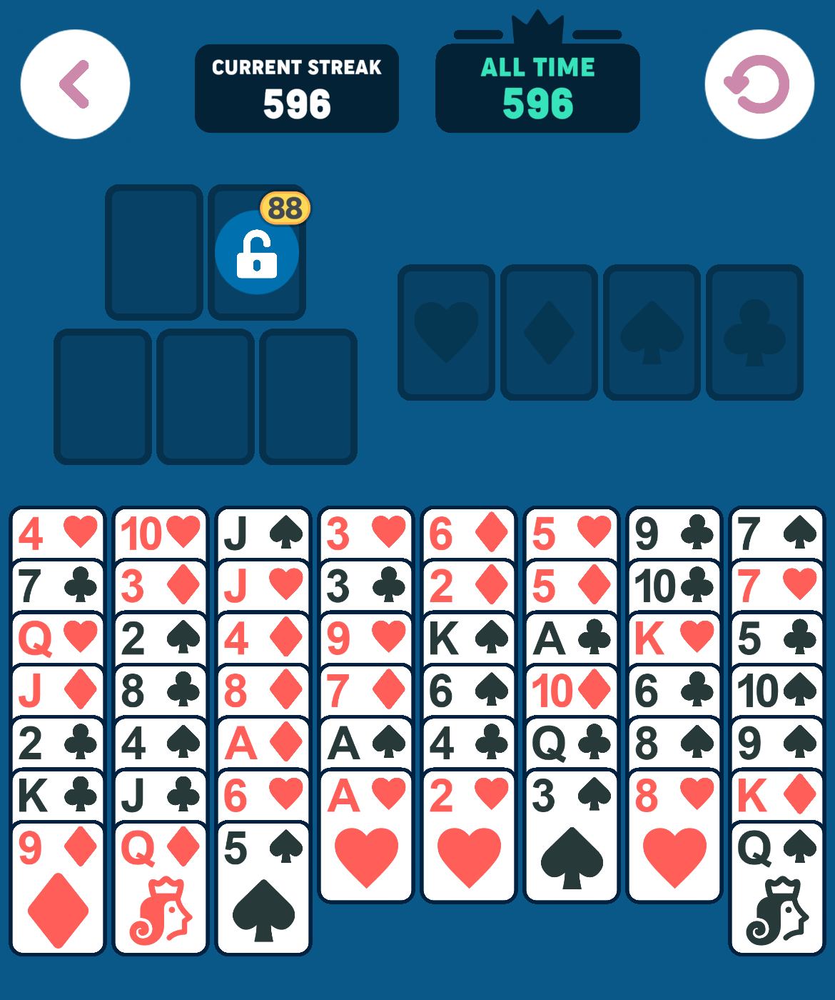
  <div style="font-size: 2em;">→</div>
  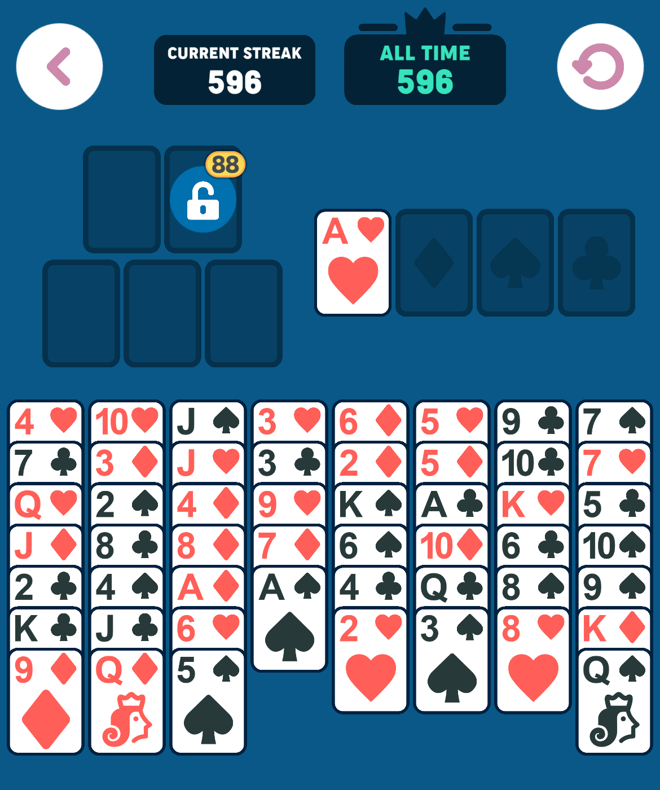
  <div style="font-size: 2em;">→</div>
  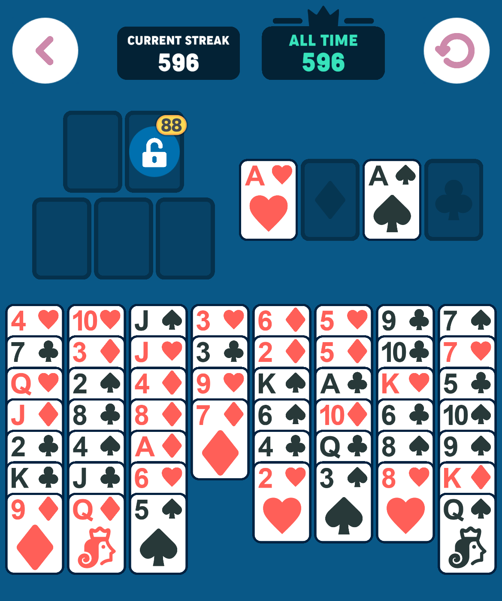
  <div style="font-size: 2em;">→</div>
  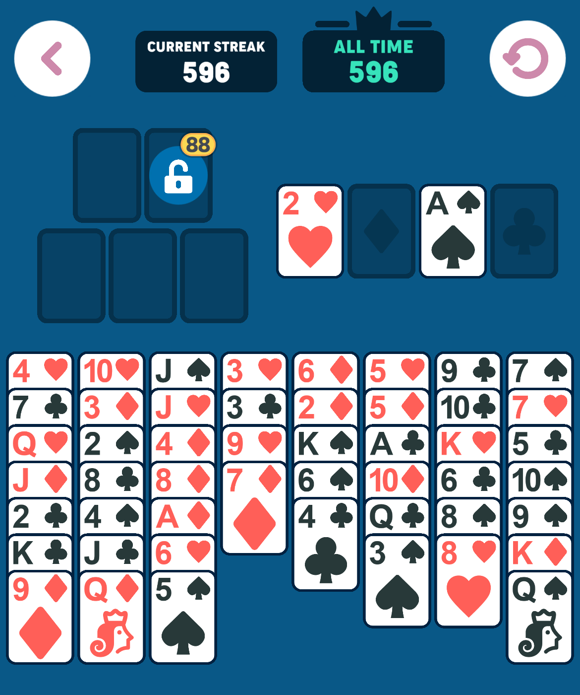
  <div style="font-size: 2em;">→</div>
  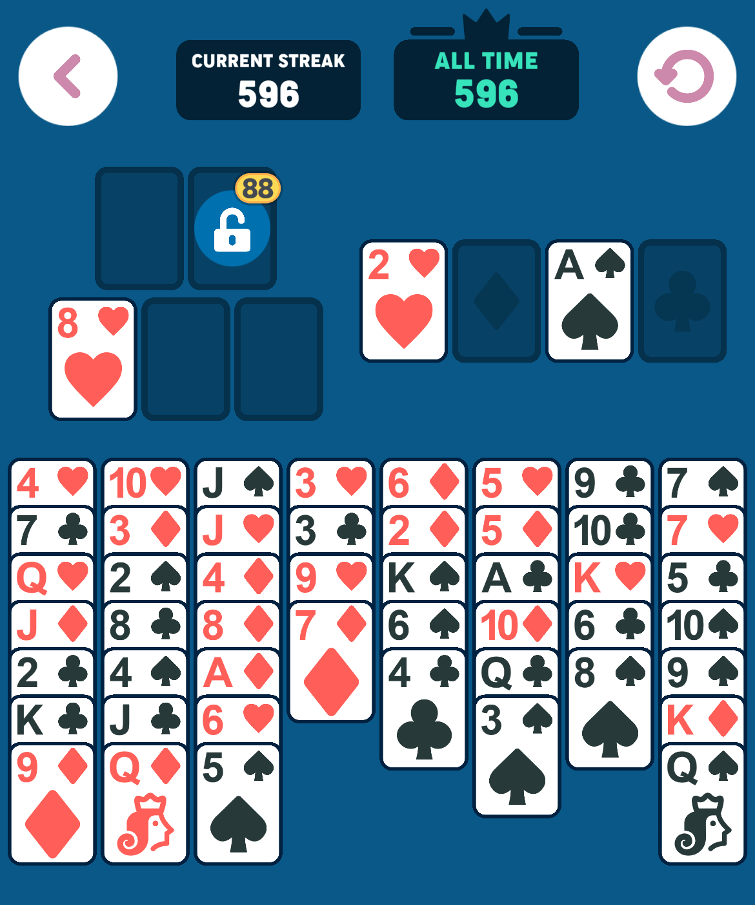
  <div style="font-size: 2em;">→</div>
  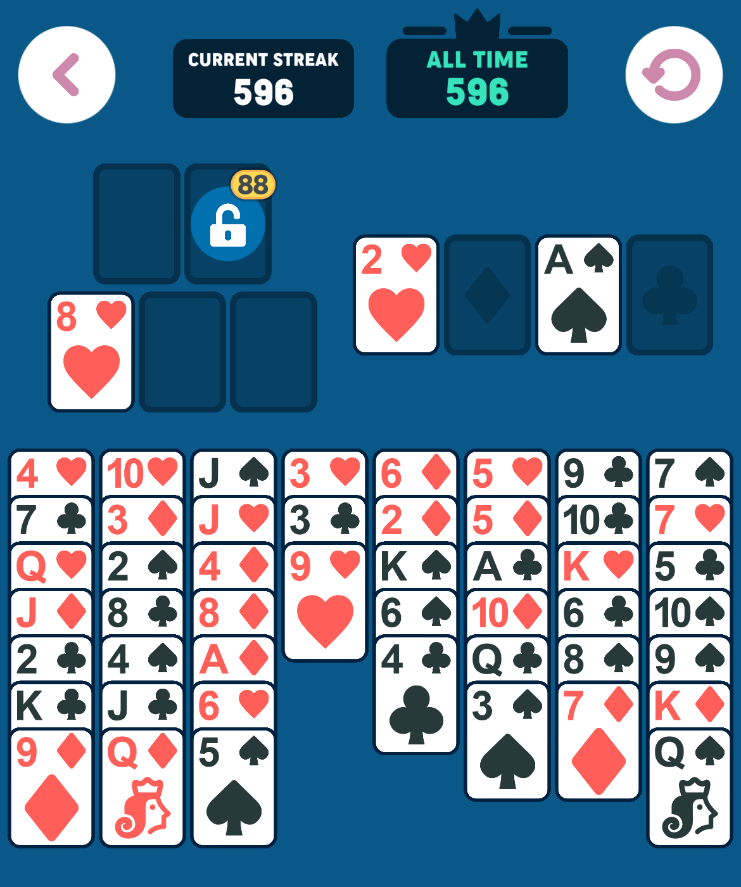
  <div style="font-size: 2em;">→</div>
  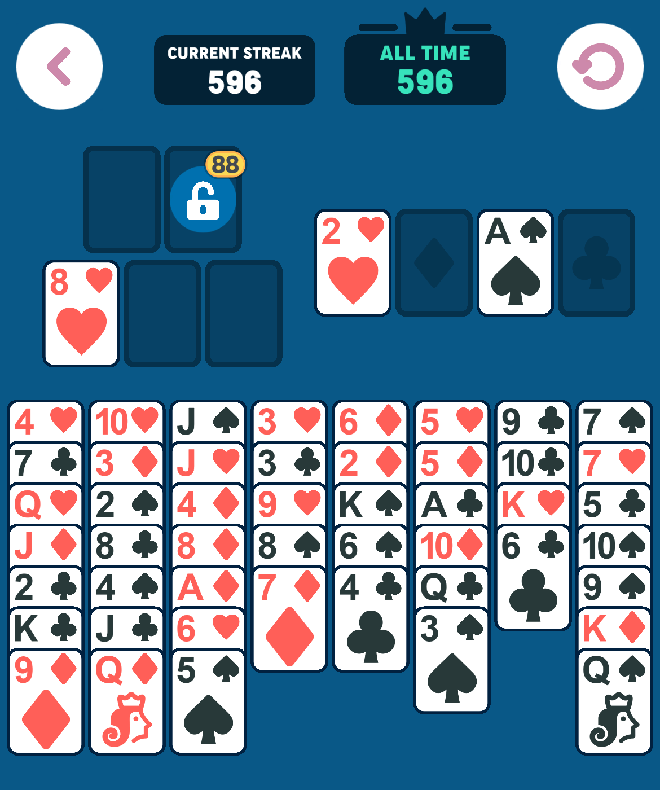
</div>
</details>

Certain moves are a "no-brainer": If the lowest card value in the foundation is x, then any card with value x+1 or x+2 can be moved to foundation without hesitation, that is, there is no reason not to make such a move. For example, in the initial state, since there are no cards in the foundation piles (x=0), any Ace or 2 can be moved to the foundation immediately. The iOS app does this and we also take advantage of it in our solver.

## Core Implementation
The game state is represented by three main components:
1. Tableau piles (main playing area)
2. Foundation piles (goal area, building up from Ace by suit)
3. Temporary slots (free cells for temporary card storage)

Here's a simplified version of the game state:

```python
class GameState:
    def __init__(self, tableau, foundation, temp_slots):
        self.tableau = tableau          # List of card piles
        self.foundation = foundation    # Dict tracking progress by suit
        self.temp_slots = temp_slots    # Set of cards in temporary storage
```

The GameState class has various methods to validate and move cards, check the game state, and display it in different ways. The most important method is the heuristic function that estimates how far a state is from the solution. It is used in A* search algorithm.

## The A* Search Algorithm
For the solver, I used the A* search algorithm. This algorithm essentially combines breadth-first search with a priority queue to prioritize exploring **promising** states first. A promising state is one that is likely to lead to the solution. We estimate how close a state is to the solution using a heuristic function: the lower the heuristic value, the closer the state is to the goal. 

At a high level, the algorithm works as follows:

~~~
Start with the initial game state, an empty set to keep track of visited states, and a priority queue.
While the priority queue is not empty:
    Remove the state with the best (lowest) heuristic value from the queue.
    If this state is the goal, stop: solution found.
    For each valid move possible from the current state:
        Create the new state by applying the move.
        If the new state has not been visited yet:
            Add it to the visited set.
            Insert the new state into the priority queue, prioritized by its heuristic value.
If no solution is found after all possibilities are checked, return failure.
~~~

In general, if the initial state is solvable, the algorithm will find the solution eventually no matter how good or bad the heuristic is: The breadth-first search will eventually explore all possible moves. However, a good heuristic can significantly reduce the number of states explored. In fact, the difficult part is coming up with a good heuristic

## Heuristic Function

I iterated over many versions of the heuristic function. When I play the game myself, I try to move towards a state where I can reach the lowest valued cards in the tableau; for instance, initially, I aim to reach the Aces. I tried to capture this in the heuristic function.

Here's the eventual heuristic I came up with:

```python
def heuristic(self, power_factor=0):
    cost = 0
    for pile in self.tableau:
        for i in range(len(pile) - 1):
            card = pile[i]
            cost += sum(
                1 for j in range(i + 1, len(pile)) if card.value < pile[j].value
            ) * pow(self.max_value - card.value, power_factor)

    return cost
```

This heuristic is computed as follows:
1. For every pile:
    1. For each card in the pile:
        1. Count how many cards below it are of higher value. This is a base cost.
        2. Compute the difference between the maximum card value in the game (13 in a standard deck) and the card's value, and raise this difference to a given power factor
        3. Multiply the base cost by the value computed in step 2
    2. Sum the costs for all cards in the pile
2. Sum the costs for all piles

Intuitively, the heuristic function penalizes piles where smaller valued cards are blocked by larger valued cards. The penalty is scaled by how small the blocked card's value is: an Ace blocked by 5 cards is more costly than a 10 blocked by 5 cards. Power_factor further controls how much this penalty is scaled.

Here are some examples of game states and their heuristic values (Power factor is 1). First, an initial state:

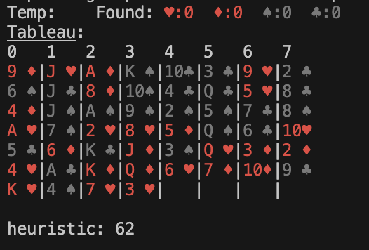{: .mx-auto.d-block :}

Here are 3 possible next states after one move. Ignoring the other possible moves for the time being, the A* search will explore the state with the lowest heuristic value (the 2nd one) in the next iteration.

<details markdown="1">
<summary>Example: Heuristic Values</summary>
<div style="display: flex; flex-direction: column; align-items: center; gap: 10px;">
  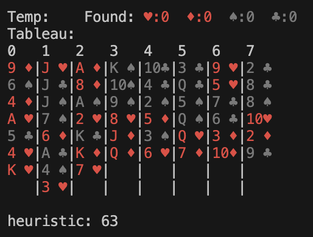
  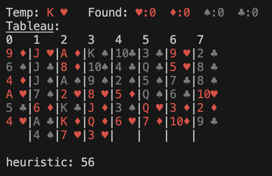
  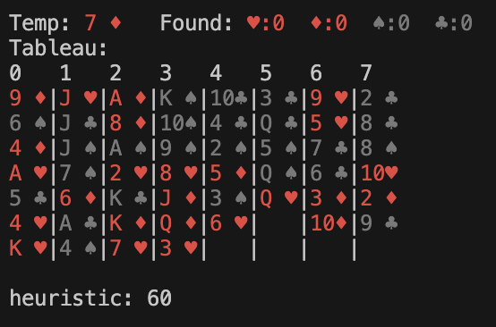
</div>
</details>

## Results and Insights
I have manually entered various test cases from difficult levels, as well as randomly generated states. The solver was able to solve all of them. I never encountered an unsolvable state.

Regarding the power factor: It is on average best to set it to 0, which means the base cost per card is not scaled. For some cases, however, a higher power factor can be more effective. A more advanced algorithm might dynamically adjust the power factor based on the progress or the current game state.

| Power Factor | Average Number of States | Max Number of States |
| :------ |:--- | :--- |
| 0 | 13,027 | 379,737 |
| 0.5 | 11,352 | 341,911 |
| 1 | 27,450 | 1,323,038 |
| 2 | 24,639 | 1,332,178 |

Here is a plot of visited states vs power factor for 20 random test cases. As you can see, the best power factor for each test case is different.

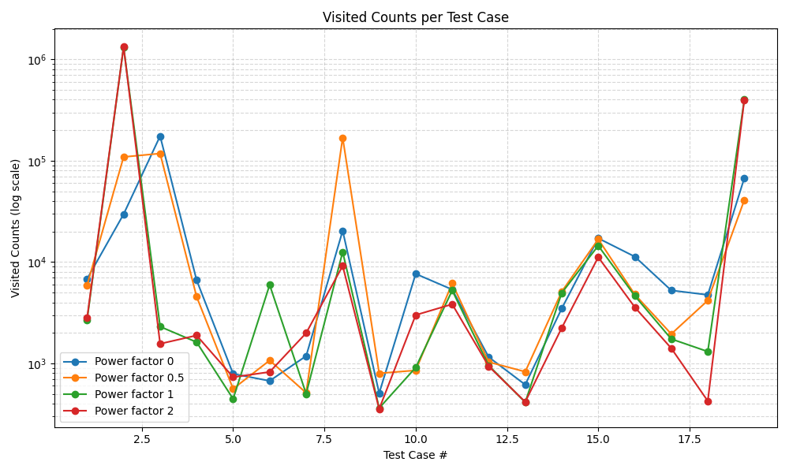{: .mx-auto.d-block :}

Key learnings:
1. The heuristic function's accuracy dramatically affects performance.
2. Changing the power factor leads to faster solutions for some cases and slower for others. There is no single optimal power factor that improves all solutions, but generally, a power factor of 0 is the best choice.
3. Randomly generated initial states were always solvable, and I wasn't able to create an unsolvable state by hand.

The complete implementation is available on [GitHub](https://github.com/saidmoglu/free-cell-solver).
